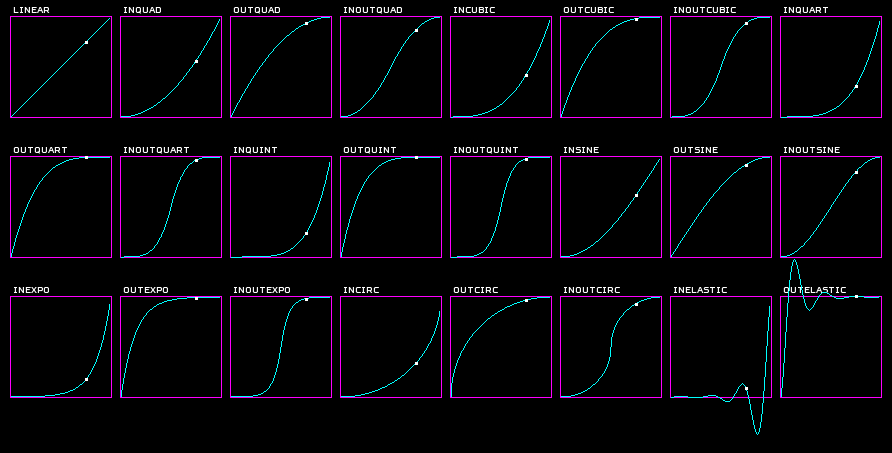

# Black Coat Animations

When it comes to animations, be it value and time based animations (aka. Tweening) or classical frame-by-frame animations the Black Coat Engine got you covered.

## Tweening

Creating a Tweening animation (short tween) is as easy as calling a method. Lets get started:
1. Create an entity of your choice you wish to animate i.e "myEntity".
2. To create an animation simply call `_Core.AnimationManager.Run(startValue, endValue, duration, update));`
Here is what each parameter is for:
   - startValue: the exact value of the first call to update at the beginning of the animation
   - endValue: the exact value of the last call to update at the end of the animation
   - duration: the amount of time the animation should take in seconds to get from start to end
   - update: a lambda expression or delegate accepting one float value. This callback is called during the animation providing the currently interpolated value. Giving you the ability to use the value as you see fit.
   - (Optional) onComplete: a parameterless lambda expression or delegate that is called when the animation has ended
   - (Optional) interpolation: lets you choose how the values are interpolated between start and end value.
  The following interpolations are available:
  
3. Lets make your entity move along the X axis:
`_Core.AnimationManager.Run(0, 200, 5, v=> myentity.Position = new Vector2f(v,0)));`
If you run your project now you will see your entity is smoothly moving along its path.
4. It is also easy to chain animations together with the optional onComplete callback:
```
// Move forward
_Core.AnimationManager.Run(0, 200, 5, 
    v=> myEntity.Position = new Vector2f(v,0), 
    ()=>
    {
        // Lets wait a bit
        _Core.AnimationManager.Wait(5,
        ()=>
        {
            // Then move back again
            _Core.AnimationManager.Run(200, 0, 5, v=> myEntity.Position = new Vector2f(v,0));
        });
    }
));
```
As you can see, chaining animations can get your code a little cluttered so make your life easy by using helper methods:
```
_Core.AnimationManager.Run(0, 200, 5, MyMoveHelper,
    ()=> _Core.AnimationManager.Wait(5,
        ()=> _Core.AnimationManager.Run(200, 0, 5, MyMoveHelper)));

[...]

private void MyMoveHelper(float value)
{
    myEntity.Position = new Vector2f(value, 0));
}
```
It is important to point out that value based animations are not limited to moving stuff around. Since your code decides what happens with the interpolated value you can use the animation system to animate basically everything. Making stuff grow or shrink? Animate its scale. Blending or fading entities? Just use their Alpha property. Animating color transitions? No Problem. Animating sound positions or volume? You betcha! Want to see it all happen in slow motion? Checkout `Layer_Game.TimeMultiplier` and since its a float value you could even animate that too!

## Frame based Animations

Black Coat supports both Blitting Animations (as in having all frames in one graphic) and Frame Animation (one graphic per frame). It all boils down to providing the animation entities the information required to understand the format of you animation. Lets get started:

### Blitting Animations

1. To create a blitting animation you first need to provide a set of rectangular area definitions that describe each frame within your source graphic. To do so simply create an array of IntRects `var frames = new IntRect[size]` where size is the amount of frames in your animation.
2. You can now define each frame i.e.: `var frames[0] = new IntRect(0,0, 32,32)`. If you have large animations with a lot of frames I recommend to automate this process with a `for` loop.
3. Now that you got your frames all set up you need a way to display them. Remember when you were told that there are a lot of prefab entities available? Exactly! Black Coat has an entity type for that already included ;-). You'll need the name space `using BlackCoat.Entities.Animation;`
4. All thats left is putting it all together var `var myAnimation = new BlittingAnimation(_Core, duration, texture, frames);`
    - duration defines the time it takes from one frame to the next
    - texture defines the source texture where all your frames are stored
    - frames simply is the IntRect array you created earlier
Your done.
Don't forget to add your entity to a layer or container of your choosing and watch your animation go.

### Frame Animations

Frame animations work almost identical to blitting animations with the major difference that each of its frames is a standalone texture. Lets go:
1. Load all your frame textures in a texture array `var frames = new Texture[size]` where size is the amount of frames in your animation.
Trouble loading your textures? Check out the tutorial on loading assets [HERE](DrawingThings.md).
2. Add `using BlackCoat.Entities.Animation;` to your list of name spaces.
3. Finally instantiate the right entity type for the job `var myAnimation = new FrameAnimation(_Core, duration, frames);`
    - duration defines the time it takes from one frame to the next
    - frames is the Texture array you created earlier
Thats it.
Don't forget to add your entity to a layer or container of your choosing and watch your animation go.