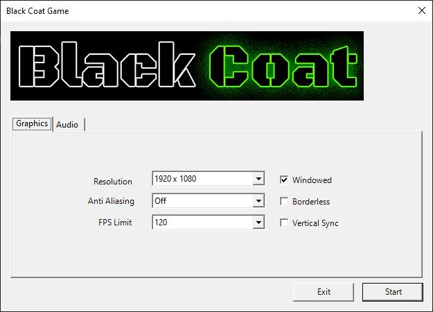

# Devices and Launchers

So far in this tutorial series you got used to using the default demo device for creating the engine core. While for small demos and tests this is perfectly fine, for actual games or larger projects one would usually like more control over the devices settings or even hand over defining those settings to the user. In Black Coat you can do it all. Before we dive in on the "how" lets have a quick look at the "what". The term "device" defines the primary target for rendering visual components, like your scene and your entities. Basically the device is either the window or full screen device (i.e: Monitor) which will display your scene to the user.

The Black Coat Engine give you 3 options on device creation:
1. Using the default devices aka: `Demo` and `Fullscreen` (you already know these)
2. Use a customizable launcher window that allows the user to create the device
3. Manually create a custom device, defining all options yourself

Lets dive in.

## Using the default Launcher

To use the default launcher for your project simply call `Device.Create()`. This will open a new window exposing all available device options to the user. Thanks to SFML the launcher will only show device settings that are available on the users hardware.



The call to `Device.Create()` is blocking as long as the Launcher is open and will return a new device based on the chosen settings. However, always make sure to check your device after creation! When the user clicks on Exit or the top right "X" or presses ALT+F4 the launcher will return `null`.
```
var device = Device.Create();
if (device == null) return;
using (var core = new Core(device))
[...]
```

### Launcher customization

As you can see, when not defining any parameters the launcher sports the usual Black Coat Banner and title. While `Create()` allows for some minor modifications only when you instantiate the launcher yourself you get to define where the device settings are stored/loaded and the option to extend the launcher with your own custom settings.

#### Managing device settings

Black Coat gives you full control over where and how device settings are saved and loaded. All you need to do is create a small class inheriting from `Launcher.ISettingsAdapter`. When passing an instance of your class to the Launchers constructor it will automatically read and write all settings to and from your class. One easy example utilizing .NETs and Visual Studios default settings feature can be seen here:
```
class SettingsAdapter : Launcher.ISettingsAdapter
{
    public (uint Width, uint Height) Resolution
    {
        get => (Settings.Default.ResolutionX, Settings.Default.ResolutionY);
        set { Settings.Default.ResolutionX = value.Width; Settings.Default.ResolutionY = value.Height; }
    }
    public uint AntiAliasing { get => Settings.Default.AntiAliasing; set => Settings.Default.AntiAliasing = value; }
    public uint FpsLimit { get => Settings.Default.FpsLimit; set => Settings.Default.FpsLimit = value; }
    public bool Windowed { get => Settings.Default.Windowed; set => Settings.Default.Windowed = value; }
    public bool Borderless { get => Settings.Default.Borderless; set => Settings.Default.Borderless = value; }
    public bool VSync { get => Settings.Default.VSync; set => Settings.Default.VSync = value; }
    public int MusicVolume { get => Settings.Default.MusikVolume; set => Settings.Default.MusikVolume = value; }
    public int EffectVolume { get => Settings.Default.SfxVolume; set => Settings.Default.SfxVolume = value; }
}
```

#### Custom settings

To add your own game settings like a difficulty or a player name to the launcher simply create a standard Winforms `UserControl` and pass it to the launchers constructor. The launcher will automatically create a new settings tab for it, titled with the `Text` property of your control. Your control will be automatically docked to fill the available space within the new tab so make sure you handle your layout accordingly.


## Manual Device creation

The manual way of creating your device is not recommended... simply because its a lot of work. But if you don't trust user defined devices or simply want full control over every detail inside your code, you can define all the options yourself by using the 4th overload to `Device.Create(videoMode, style, antiAliasing, vSync, framerateLimit, skipValidityCheck)`. Here's what's what:
- videoMode: defines the resolution of your device - make sure to check if the created mode is valid by calling `IsValid()`
- style: Window / full screen styles enumeration
- antiAlising: The level of anti aliasing that should be applied to rendering - more info [here](https://en.wikipedia.org/wiki/Spatial_anti-aliasing)
- vSync: Determines if the refresh should be synced with your monitor - if true the framerateLimit will be ignored
- framerateLimit: Defines the maximum amount of frames the renderer will create per second - the lower the value the less stress will be applied to the machine - good values are min:60 good:120 overkill:180
- skipValidityCheck: disables the validation of created devices - Pro Tip: DON'T!

Most of these parameters are simply pass through arguments to SFMLs own device creation. So if you're interested in this topic I recommend reading SFMLs own tutorial on this topic [here](https://www.sfml-dev.org/tutorials/2.5/window-window.php).