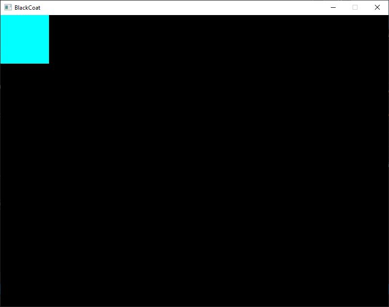

# Black Coat Engine First Steps

## Project Setup
To get the engine up and running for a new project a few extra steps are required. Don't worry, you only have to do this once. Lets get started:
1. In Visual Studio create a new Windows Forms Project. While .NetFramework is supported I recommend using the .Net Variant for .net 5.0 (Visual Studio 16.8 and later).
2. If you choose to use .net 5.0 make sure your project targets this version by verifying its properties. To do so Right click your project and choose options, then select .NET 5.0 as the Target framework.
3. Right Click dependencies and select `Manage NuGet Packages...`
4. Click on the Browse Tab and search for `SFML`
5. Install the NuGet Package `SFML.Net` by Laurent Gomila then close NuGet.
6. Add the Black Coat Engine either by
A) Adding its appropriate DLL to the list of dependencies (recommended) or
B) Adding its project to your solution and reference it via project reference.
7. Delete the default Form1 file. The engine will provide the necessary window.
8. Open the Programm.cs and clear out the `Main()` method.

## Creating a Stage
1. Create a new Class called `MyFirstScene`
2. Add `using BlackCoat;` to the list of namespaces.
3. Inherit the new class from `Scene`
4. Press Alt+Enter to bring up the quick actions then select `Implement abstract class`
5. Press Alt+Enter again then select `Generate Constructor`
6. Delete all occurrences of `throw new NotImplementedException();`

Optional: grab the destroy method and move it to the bottom of your class.

## Starting the Engine
1. Open `Programm.cs`
If you haven´t cleared the contents of your `Main()` method do so now.
2. Add `using BlackCoat;` to the list of namespaces
3. Inside your `Main()` create a new using block and define the engine core and device:
```
using (var core = new Core(Device.Demo))
{
}
```
4. Inside the using block setup the scene you created earlier:
`core.SceneManager.ChangeScene(new MyFirstScene(core));`
5. Finally lets start the engine itself:
`core.Run();`
6. Your final result should look like this:
```
using (var core = new Core(Device.Demo))
{
    core.SceneManager.ChangeScene(new MyFirstScene(core));
    core.Run();
}
```

## Adding Entities
Now that you got the engine running lets do something about the vast emptiness of your scene. Inside your scenes `Load()` method you can setup whichever actors you'd like to see in it. "Actors" are called entities throughout Black Coat and there are over a dozen different types of entities available to you.
1. Lets start simple by adding a plain rectangle to your scene. To do so add the Shapes namespace via `using BlackCoat.Entities.Shapes;` to the list of namespaces.
2. Now create a new Rectangle instance inside the `Load()` method `var rect = new Rectangle(_Core, new Vector2f(100, 100), Color.Cyan);`
If you would start your project right now however you wouldn't see a thing. Thats is because every entity needs to be explicitly added to the scene.
3. To add any entity to your scene simply add it to one of the scenes layers. In our case this looks like so: `Layer_Game.Add(rect);`
Now when you start the project you will see your newly created entity in the top left corner of your scene:


## Get Moving!
Now that you have an entity in your scene it'll get boring pretty fast since nothing is happening. Lets change that! The `Update(float deltaT)` method is being called each and every frame as long as the engine window has focus. You can use that to bring all your entities to live. In this example lets attach our rectangle to the mouse like so:
1. Promote the rect variable to a field `private Rectangle rect;` You can also do so automatically by using the Visual Studio refactoring features.
2. Now that the rectangle is inside the scope of the class we can use it in the `Update(float deltaT)` method and reassign its position:
`rect.Position = Input.MousePosition;`
When you start the project now you'll see the rectangle never leave the side of the cursor.

Your scene should now look somewhat like this:
```
class MyFirstScene : Scene
{
    private Rectangle rect;

    public MyFirstScene(Core core) : base(core)
    { }

    protected override bool Load()
    {
        rect = new Rectangle(_Core, new Vector2f(100, 100), Color.Cyan);
        Layer_Game.Add(rect);
        return true;
    }

    protected override void Update(float deltaT)
    {
        rect.Position = Input.MousePosition;
    }

    protected override void Destroy()
    { }
}
```
Of course this only scratches the surface of what you can do with Black Coat - there is a lot more you can create and a lot more to explore. So check out the other tutorials [here](README.md) and the samples section [here](../samples) where you can find example code for some of the more complex features.