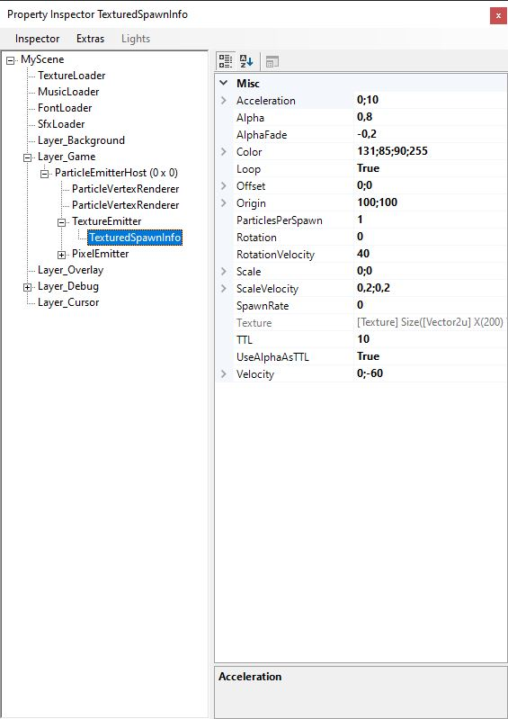

# Creating Particle Effects

Be it explosions, sparks, smoke or lightning strikes. Particles enrich every scene with beautiful visual effects. Black Coat has its own particle subsystem giving you the time and tooling to fine tune your particles without worrying about performance. Lets do this:

## Prerequisits
### Its good to be host
To add any particle effect to your scene you must create a `ParticleEmitterHost` first. The host is part of the scene graph and therefore an entity. You can picture its role a specialized container for emitters and their respective particles. Usually one container suffices for all particle effects within a scene since you can define your own particle layers within the host. Only when you need to display other entities between 2 particle depth layers you would be required to create another `ParticleEmitterHost`.
```
var particleHost = new ParticleEmitterHost(_Core);
Layer_Overlay.Add(particleHost);
```
### Using prefabs or building everything yourself?
The Black Coat Particle System is build to be very extensible. You can easily inherit from `EmitterBase` and `ParticleBase` and build your own effects from scratch, pick up somewhere higher in the inheritance hierarchy or use the default particle classes. So before adding any fancy effects you need to decide whether your planed effect requires any special coding or not. For the sake of this tutorial we assume you chose to use the existing default implementations. As you will see, you can already achieve quite a lot by just fiddling the default particle settings without the need for extra coding.

### Using Pixels or Textures?
With a `ParticleEmitterHost` ready to go and no extra inheritance mumbojumbo involved it is now time to decide what kind of effect you'd like to build. Black Coat provides you with 2 default emitter types and their according particle types:
- `PixelEmitter`: Creates literal pixels - no joke. If you need sparks, rain, or water splashes this emitter got you covered.
- `TextureEmitter`: Creates particles from a texture. It can create almost any effect as long as you have the appropriate texture for it. Smoke, explosions, gunfire, Aurora Borealis - you name it.

Great, are we done now? Can we finally get some particle action? You betcha!

## Lets get started

For this example lets pick a `PixelEmitter` for demonstration. Don't worry while a little more limited than a `TextureEmitter` its functionality and work flow is identical. SO without further ado:
```
var pixelEmitter = new PixelEmitter(_Core, ???);
particleHost.AddEmitter(pixelEmitter);
```
Uh-oh looks like we missed something important. The default particle implementations require quite a bit of information to be on their marry way. Since particles are created by their respective emitters you need to provide these emitters with all these information too. Luckily all the info comes in a handy package. For a `PixelEmitter` you'll either need a `ParticleSpawnInfo` or a `RadialSpawnInfo`. For a `TextureEmitter` you would require a `TexturedSpawnInfo` or a `RadialTexturedSpawnInfo`. However for this tutorial we'll stick with the basic `ParticleSpawnInfo` for now.
```
var pixelInfo = new ParticleSpawnInfo(_Core);
var pixelEmitter = new PixelEmitter(_Core, pixelInfo);
particleHost.AddEmitter(pixelEmitter);
```
Hey wait a second, I still can't see a thing! True. All emitters are instantiated dormant by default. All it takes is a little push: `pixelEmitter.Triggered = true;` Now, when you don't modify the spawn information, your `PixelEmitter` will simply place a single white pixel at its position that "dies" after one second... boring! Lets mix it up a little:
```
var pixelInfo = new ParticleSpawnInfo()
{
    TTL = 5,
    Color = Color.Cyan,
    Velocity = new Vector2f(10, 10),
    Acceleration = new Vector2f(-3, -10),
    Loop = true,
    SpawnRate = 0.25f
};
```
Now things are starting to move! Lets have a look at the most common spawn properties:
- TTL: stands for Time To Live and therefore defines how long each particle can exist
- Color: Color of the pixel for `PixelEmitter` and texture tint color for `TextureEmitter`
- Velocity: initial movement of each new particle
- Acceleration: change in movement over time
- Loop: this one is vital - it defines whether the emitter must be triggered for each particle (false) or just keeps on spewing more (true)
- SpawnRate: defines the time to wait until a new batch of particles should be emitted - only functional when Loop = true

There are many more properties you can play with to create many different types of effects. For example with `Alpha` and `AlphaFade` you can blend particles neatly into each other, both of these become especially important when you are using `UseAlphaAsTTL` which does **NOT override the TTL** but is used as a preemptive condition. So make sure your `TTL` is big enough to give `UseAlphaAsTTL` enough time to do its magic.

### More Randomness... MOOORE!
For many basic effects a `ParticleSpawnInfo` or its textured partner the `TexturedSpawnInfo` will do the trick. However for more complex effects the linear movement and single point of origin will be insufficient. The solution is randomness. For a basic set of randomness I recommend taking a look at the radial variants of each spawn info type but for even more sophisticated spawn settings you'll need to create your own spawn info type. Don't worry this is less work than it sounds like. If you use your own spawn info class you can even use them as info templates, saving you even more work. Take a look:
```
class PixelFireInfo : ParticleSpawnInfo
{
    private readonly Core _Core;

    // Add randomness via overrides
    public override Vector2f Offset
    {
        get => _Core.Random.NextVector(-20,20,0,5);
        set => base.Offset = value;
    }

    public PixelFireInfo(Core core)
    {
        // Save the core to access the random helper
        _Core = core;

        // Create templates via default values:
        Velocity = new Vector2f(0, -20);
        Color = Color.Red;
        Loop = true;
        SpawnRate = 0.2f;
        ParticlesPerSpawn = 10;
    }
}
```
This shrinks down you emitter creation to this: `var pixelEmitter = new PixelEmitter(_Core, new PixelFireInfo(_Core));` Hows that for re-usability?

## Fine tuning your emitters

When working with particles you'll often find yourself constantly changing spawn infos then immediately building and restarting your application over and over again to see the results. This can get tedious very fast. To avoid frustration I recommend using the live inspection feature of Black Coat. You can activate it either by calling `OpenInspector();` at the end of your `Load()` method or by typing "inspect" into the scenes console (Strg+Shift+1). With the inspector you are able to modify most properties of most items inside your scene. This is specifically useful for tuning particles as you can see any modification to your spawn info immediately.


Pro Tip: you can even inspect and test emitters where `Loop = false`. Checkout Inspector -> Menue -> Extras -> ITriggerEmitter.Trigger