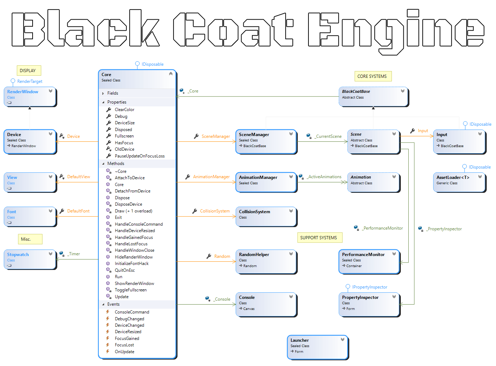
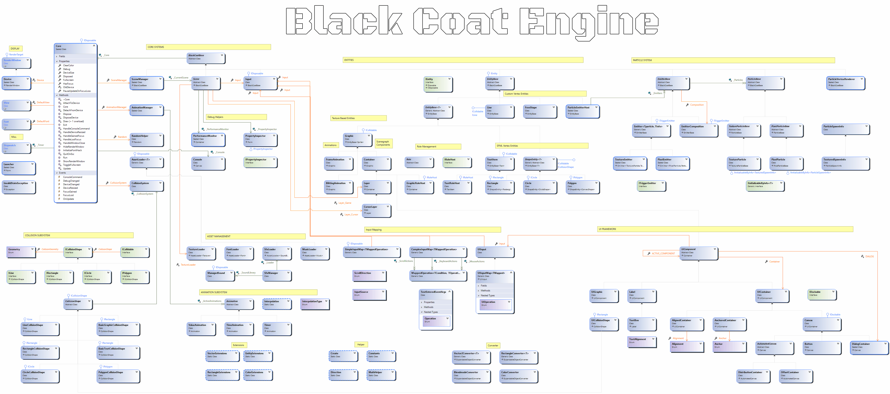

# Learning Black Coat

Welcome to the tutorial section.
In this area you'll find helpful documents to get you started making games with the Black Coat Engine.

## Tutorials

The following tutorials are available. For an optimal learning experience complete them in the order shown below:

1. [First Steps](FirstSteps.md)
2. [Drawing Things](DrawingThings.md)
3. [Creating Animations](CreatingAnimations.md)
4. [Creating Particle Effects](Particles.md)
5. [Handling Devices and Launchers](DevicesAndLaunchers.md)
6. Adding sounds and music - under construction
7. Creating User Interfaces - planned

## Core Systems Overview

## Full Class Overview
