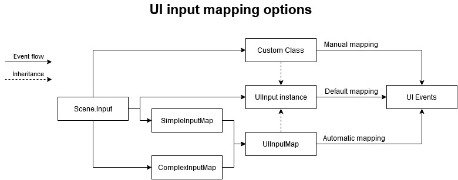

# Creating User Interfaces

Black Coat comes with its own UI framework located in the name space `BlackCoat.UI;`. With this framework you are be able to build complex, dynamic UIs with minimal effort. The classes of this framework and their respective instances are often called "components" to indicate their association to the UI framework. Don't get fooled though, while so far the term "entities" was only applied to graphical game elements, components ARE entities since they are part of the scene graph as all visible elements are. Enough with the vocabulary though, lets get started:

## Managing Input for UIs

So far when it came to reacting to user input, a simple request to the scenes `Input` was sufficient. However the UI uses its own input format and therefore needs a mapper to be able to consume input events. If you forget to specify an input for your UIs root component the UI will not be able to react to user input. To make your life easier Black Coat provides a base class on that matter called `UIInput`. It defines the input format via the following events:
- Move: Occurs when the focus tries to move to another UI Component.
- BeforeConfirm: Occurs right before a confirm event.
- Confirm: Occurs when the user confirms an operation. I.e.: Clicks on a component.
- Cancel: Occurs when the user wants to chancel the current operation or dialog.
- Edit: Occurs when the user desires to enter an edit state. I.e.: Focusing a text field.
- Scroll: Occurs when the user tries to scroll through content.
- TextEntered: Occurs when the user enters text.

With the class `UIInput` you can now either use its default mapping for Keyboard and Mouse like so: `var uiInput = new UIInput(Input, true);` or you can define your own custom mapping by inheriting from `UIInput` and call each of the Invoke methods yourself. If you are already using either Black Coats `SimpleInputMap` or `ComplexInputMap` you don't need to create your own UI Input implementation. Either mapper is supported by the `UIInputMap` class which - you guessed it - already inherits from `UIInput`. All you need to do is to provide an appropriate mapping, for example:
```
// Game Input
var simpleInputMap = new SimpleInputMap<GameAction>(Input);
// your game input definition goes here
[...]

// UI Input
var mapping = new Dictionary<GameAction, (UiOperation activation, UiOperation deactivation, float direction)>()
{
    { GameAction.Left, (UiOperation.Move, UiOperation.None, Direction.LEFT) },
    { GameAction.Right,(UiOperation.Move, UiOperation.None, Direction.RIGHT) },
    { GameAction.Up,   (UiOperation.Move, UiOperation.None, Direction.UP) },
    { GameAction.Down, (UiOperation.Move, UiOperation.None, Direction.DOWN) },
    { GameAction.Fire, (UiOperation.BeforeConfirm, UiOperation.Confirm, 0) },
    { GameAction.Jump, (UiOperation.Cancel, UiOperation.None, 0) }
};
var map = new UIInputMap<GameAction>(simpleInputMap, mapping);
```
For a better understanding take a look at this visualization on how events may flow. Each of its branches is one way of implementing your own solution:



## UI Construction

The second step is to define a root UI component. You must either use a `UIContainer` or any other component inheriting from it as root and place all other components within its hierarchy.
```
var root = new UIContainer(_Core)
{
    Input = map // Never forget to set your input!
};
Layer_Game.Add(root);
```
With your root and UIInput in place, you now have 2 options to build your UI: procedural construction and functional construction.

### Procedural Construction

Procedural construction works exactly the same way as you created your games entities before:
```
var buttonSize = new Vector2f(45, 20);
var button = new Button(_Core, buttonSize);
button.BackgroundColor = Color.Red;
button.Pressed += b => Trace.WriteLine($"{b} was pressed");
root.Add(button);
```
You define your components and add them to the scene graph beneath your root - no magic here.

### Functional Construction

When building large or complex UIs via procedural construction you will quickly create large amounts of boiler plate code. To avoid going mad over component instantiation use the UI frameworks functional construction feature instead. With it you can quickly chain initializations together, creating complex component trees with minimal effort. Example:
```
var root = new OffsetContainer(_Core, Orientation.Vertical,
    new Button(_Core, buttonSize),
    new Button(_Core, buttonSize),
    new Button(_Core, buttonSize),
    new Button(_Core, buttonSize))
{
    Input = map
};
```
Each UI component that is designed to contain other UI components provides a constructor that allows you to directly define its child components. For plain instantiation this works perfectly well however as soon as you need to initialize properties for your components this syntax may become troublesome. As you can see the more components you create the greater the distance becomes, between your root component and its properties. For complex initializations, including component creation and setting of properties, you can use the `Init` property instead. It allows you to set all properties of a component and then continue building the structure of your UI like so:
```
var root = new OffsetContainer(_Core, Orientation.Vertical)
{
    Input = map,
    Init = new UIComponent[]
    {
        new Button(_Core, buttonSize) { InitPressed = HandleButtonPressed },
        new Button(_Core, buttonSize) { InitPressed = HandleButtonPressed },
        new Button(_Core, buttonSize) { InitPressed = HandleButtonPressed },
        new Button(_Core, buttonSize, new Label(_Core, "Click Me"))
        {
            InitPressed = HandleButtonPressedc
        }
    }
};
```
As you can see, most components expose `Init<EventName>` properties for their events. This way you can assign event handlers as you would any other property. Did you notice the `Label` on the last button example? It shows that you can even mix both construction methods, creating clean, structured, easy to read UI definitions.

## Layout

While you can set each components position manually it is often better to build automatic layouts that adapt to the available space and current device resolution. To do so in Black Coat simply utilize one of the dynamic UI containers and their docking options:
1. `AlignedContainer`: A component that aligns its borders to the appropriate border of its parent. I.e. a HUD that always sticks to the bottom your screen.
2. `AnchoredContainer`: A component that calculates its position relative to its anchor. I.e. A dialog close button that is anchored to the top right of your dialog.
3. `Canvas`: See "Canvases and Docking" below.
4. `OffsetContainer`: A component that automatically positions its child components based on its orientation and offset. I.e. a set of equally spaced buttons.
5. `DistributionContainer`: Similar to the `OffsetConatainer` this component automatically positions its child components based on its orientation but then evenly distributes the available space inside of it instead using a fixed offset. This works best when you dock this component into any container component with variable size. I.e. A resizeable inventory which looks nice on any size and resolution.

### Canvases and Docking

Next to the `UIContainer` the `Canvas` is the most commonly used container when building UIs. The main difference between the two is that you can give Canvases a fixed size whereas a `UIContainer` will always have its size defined by its contents. Second, Canvases and all components inheriting from it can be docked. Docking means that a component will automatically use all the available space of its parent, you can even dock to one dimension only and let the other grow with the contents as usual. Example:
```
var root = new Canvas(_Core, _Core.DeviceSize)
{
    Input = uiInput,
    Init = new[]
    {
        new DistributionContainer(_Core, Orientation.Vertical)
        {
            DockX = true,
            Init = new[]
            {
                new Label(_Core, "Item 1"),
                new Label(_Core, "Item 2"),
                new Label(_Core, "Item 3")
            }
        }
    }
};
_Core.DeviceResized += root.Resize;
Layer_Game.Add(root);
```
Note that you have to handle the `DeviceResized` event explicitly. A UI component can only be docked to another UI component! When you want a `Canvas` size to be defined by something else you have to call its `Resize()` method yourself.

Pro-Tip: When using any of the automatic layout options, you often end up with components being placed right at the border of another component. While this may be the most efficient way of using the available space it often results in quite the odd locking UI. Since setting a components position is not possible when it is managed by an automated layout component (the position would be immediately reset) you want to use its `Margin` property instead. This property allows you make any component bigger (or smaller) than it actually is and therefore adjust its position within any of the automatic layout mechanisms.

## Dialogs

Creating dialogs or popups with black Coats UI framework is extremely easy. All you need to do is to define your dialog content as you would any other UI then call `ShowDialog(layer, dialogContent);` where "layer" is the one of your scenes layers where you want the dialog to appear - usually `Layer_Overlay`. Example:
```
var dialog = new Canvas(_Core, _Core.DeviceSize / 2)
{
    Position = _Core.DeviceSize / 2,
    Origin = _Core.DeviceSize / 4,
    BackgroundColor = Color.Green,
    Init = new UIComponent[]
    {
        new AlignedContainer(_Core, Alignment.Center,
            new OffsetContainer(_Core, Orientation.Vertical, 20,
                new Label(_Core, "Do you like Black Coat?", 20),
                new OffsetContainer(_Core, Orientation.Horizontal, 30,
                    new Button(_Core, null, new Label(_Core, "Hell Yeah!"))
                    {
                        BackgroundColor = Color.Blue
                    },
                    new Button(_Core, null, new Label(_Core, "Absolutely!"))
                    {
                        BackgroundColor = Color.Blue
                    }
                )
            )
        )
    }
};
root.ShowDialog(Layer_Overlay, dialog);
```
**Important:** You can call `ShowDialog()` anytime, via any component you like but it has to have a valid input within its hierarchy otherwise the dialog will have no input as well and therefore lock you out. The easiest way to avoid creating unresponsive dialogs is by calling the method from either your UIs root component or from an event handler like so:
```
private void HandleButtonPressed(Button button)
{
    button.ShowDialog(Layer_Overlay, <your dialog content>);
}
```

## UI Tweaking

When working with large UIs you'll often find yourself constantly changing component properties then immediately building and restarting your application over and over again to see the results. This can get tedious very fast. To avoid frustration I recommend using the live inspection feature of Black Coat. You can activate it either by calling `OpenInspector();` at the end of your `Load()` method or by typing "inspect" into the scenes console (Strg+Shift+1). With the inspector you are able to modify most properties of most items inside your scene. This is specifically useful for adjusting any part of your UI as you can see any modification to your components immediately.

Pro-Tip: when you have adjusted a component to your liking and want to move all the settings into your code you can copy all properties and values at once using Menu -> Inspector -> Export current Object. However to use this feature make sure your `Main` is decorated with the `[STAThread]` attribute.